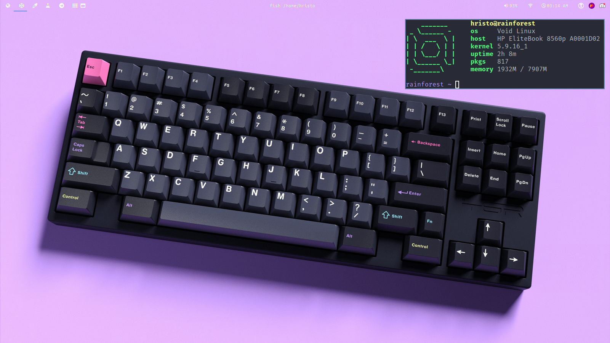
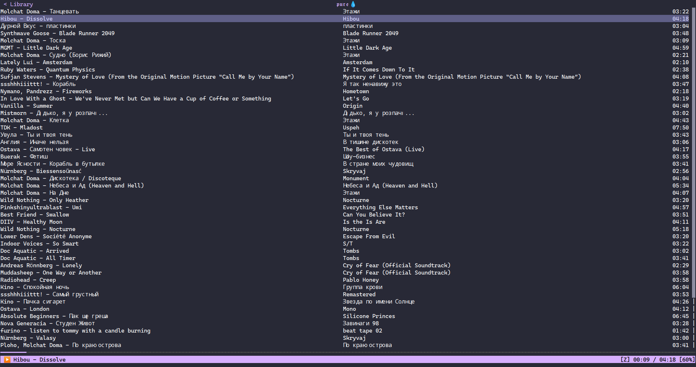
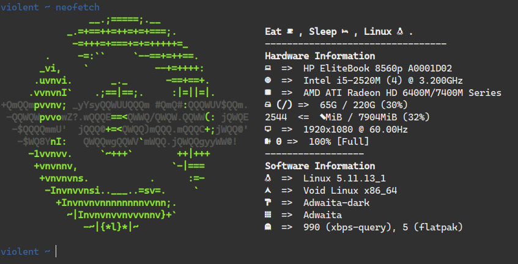
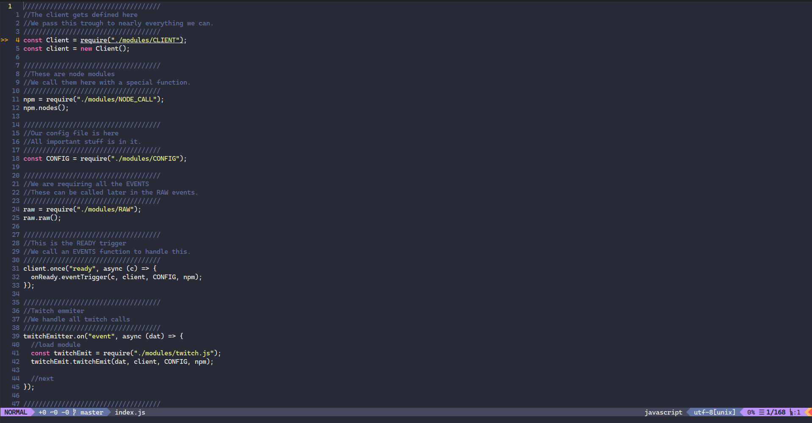
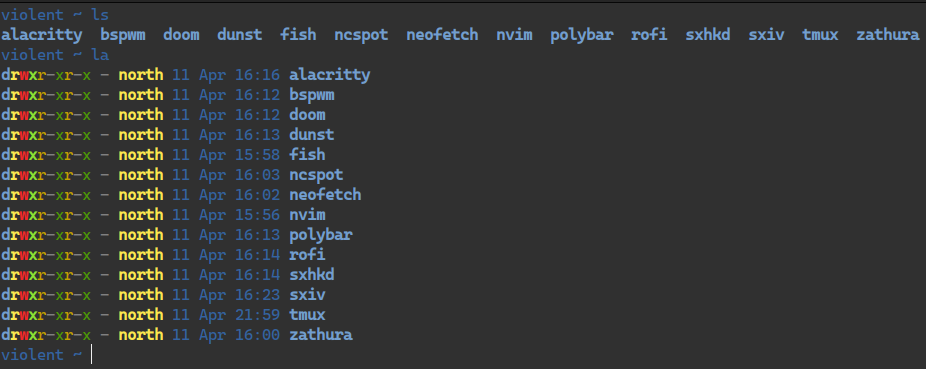
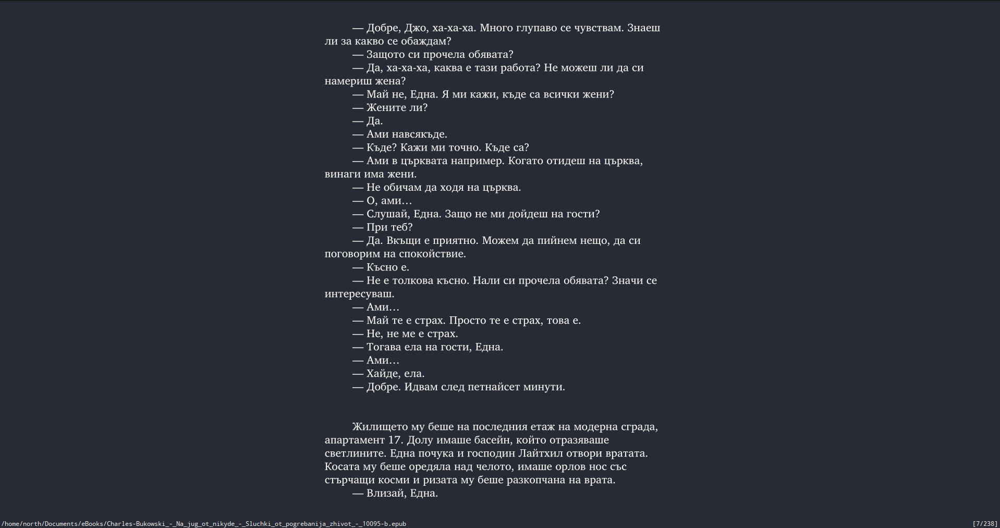

# zerw's Dotfiles

## Software i use:
* Linux Distribution: Void Linux and Arch Linux (btw)
* Browser: Mozilla Firefox with [these](pix/extensions.png) extensions and Chromium for testing.
* Image Editor: GNU Image Manipulation Program (GIMP)
* Image Viewer: sxiv
* Office Suite: LibreOffice
* PDF/ePUB Reader: Zathura
* Video Player: MPV
* Torrent Client: qBittorrent on the desktop and Deluge on my homeserver.
* Audio Recorder(?): Audacity
* System Monitor: htop/gotop
* Shell: Fish
* Backup Software: Timeshift with BTRFS Snapshots
* Syncing: Syncthing and Nextcloud
* File Editor: NeoVim and sometimes GNU Emacs
* VM Software: virt-manager
* Music Software: ncspot (*spotify go brrr*)
* Window Manager: bspwm (Using GNOME in most of the time tho)
* Terminal Emulator: Tilix and Kitty
* Bar (when using a WM): polybar
* Terminal Multiplexer: tmux
* Notification Daemon: dunst
* Launcher(?): Rofi
* Screen Recorder: OBS Studio
* Mail Client: Thunderbird
* OTP Client: Aegis and OTPClient

*I use some proprietary/nonfree software like Discord,Viber,Parsec,MS Teams and the Intel Microcode, but i just can't live without them*

## Pictures



*Source: UtopicUnicorn/.initrd's Discord bot Artemis V3. [Link](https://github.com/UtopicUnicorns/artemisv3)*




**Using CaskaydiaCove Nerd Font Mono Book and Fira Mono in terminal. You need nerd-fonts/nerd-fonts-complete for fonts to work.**

## Usage

I use [GNU Stow](https://www.youtube.com/watch?v=MJBVA4LeJKA) for managing my dotfiles. You can install it from your package manager, idk.
```
cd ~
git clone https://gitlab.com/zerw/dotfiles.git
cd dotfiles
stow nvim (or something else)
```

