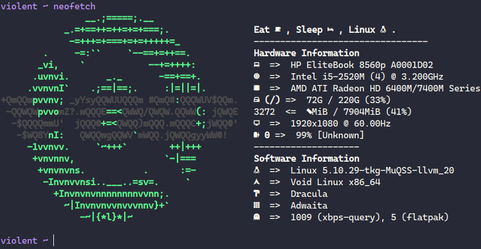

# zerw's Dotfiles

## Pictures

*You need noto-fonts/noto-fonts-complete for polybar and other stuff*


*You need noto-fonts for that too*


**Using CaskaydiaCove Nerd Font Mono Book and Fira Mono in terminal**

## Usage

I use [GNU Stow](https://www.youtube.com/watch?v=MJBVA4LeJKA) for managing my dotfiles. You can install it from your package manager, idk.
```
cd ~
git clone https://gitlab.com/zerw/dotfiles.git
cd dotfiles
stow nvim (or something else)
```

