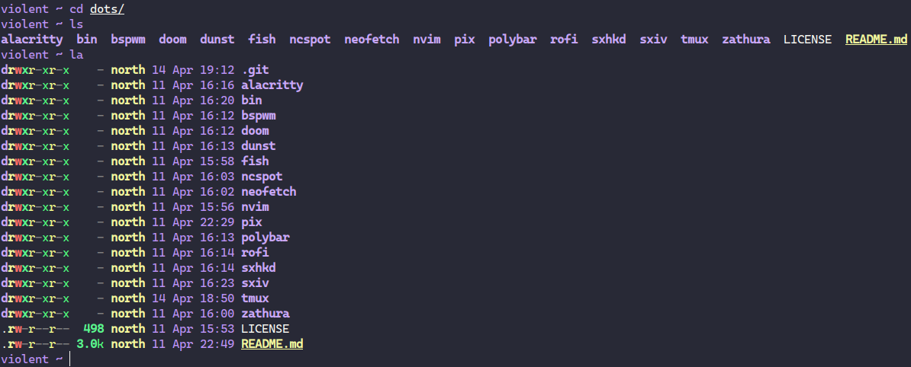

# zerw's Dotfiles
My personal dotfiles/.files for the software i use :)

## Software i use:
* Linux Distribution: [Void Linux](https://voidlinux.org) and [Arch Linux](https://archlinux.org) (btw)
* Browser: [Mozilla Firefox](https://www.mozilla.org/en-US/firefox/new/) with [these](pix/extensions.png) extensions and [Chromium](https://chromium.org) for testing.
* Image Editor: [GNU Image Manipulation Program (GIMP)](https://www.gimp.org)
* Image Viewer: [sxiv](https://github.com/muennich/sxiv)
* Office Suite: [LibreOffice](https://www.libreoffice.org/)
* PDF/ePUB Reader: [Zathura](https://pwmt.org/projects/zathura/) with zathura-mupdf-poppler
* Video Player: [mpv](https://mpv.io)
* Torrent Client: [qBittorrent](https://www.qbittorrent.org/) on the desktop and [Deluge](https://github.com/binhex/arch-delugevpn) on my homeserver.
* Audio Recorder(?): [Audacity](https://www.audacityteam.org/)
* System Monitor: [htop](https://htop.dev/)/[gotop](https://github.com/xxxserxxx/gotop)
* Shell: [fish](https://fishshell.com/)
* Backup Software: [Timeshift](https://github.com/teejee2008/timeshift) with BTRFS Snapshots
* Syncing: [Syncthing](https://syncthing.net/) and [Nextcloud](https://nextcloud.com/)
* File Editor: [Neovim](https://neovim.io/) and sometimes [Doom Emacs](https://www.gnu.org/software/emacs/)
* VM Software: [virt-manager](https://virt-manager.org/)
* Music Software: [ncspot](https://github.com/hrkfdn/ncspot) (*spotify go brrr*)
* Window Manager: [bspwm](https://github.com/baskerville/bspwm) (Using [GNOME](https://www.gnome.org/) in most of the time tho)
* Terminal Emulator: [Tilix](https://gnunn1.github.io/tilix-web/) and [Kitty](https://sw.kovidgoyal.net/kitty/)
* Bar (when using a WM): [polybar](https://polybar.github.io/)
* Terminal Multiplexer: [tmux](https://github.com/tmux/tmux)
* Notification Daemon: [dunst](https://dunst-project.org/)
* Launcher(?): [Rofi](https://github.com/davatorium/rofi)
* Screen Recorder: [OBS Studio](https://obsproject.com/)
* Mail Client: [Thunderbird](https://www.thunderbird.net/en-US/)
* OTP Client: [Aegis](https://getaegis.app/) and [OTPClient](https://github.com/paolostivanin/OTPClient)
* Matrix Client: [Fractal](https://wiki.gnome.org/Apps/Fractal) and [fluffychat](https://fluffychat.im/)

*I use some proprietary/nonfree software like Discord,Viber,Parsec,MS Teams and the Intel Microcode, but i just can't live without them*

## Pictures


*Source: UtopicUnicorn/.initrd's Discord bot Artemis V3. [Link](https://github.com/UtopicUnicorns/artemisv3)*




**Using CaskaydiaCove Nerd Font Mono Book and Fira Mono in terminal. You need nerd-fonts/nerd-fonts-complete for fonts to work.**

## Usage

I use [GNU Stow](https://www.youtube.com/watch?v=MJBVA4LeJKA) for managing my dotfiles. You can install it from your package manager, idk.
```
cd ~
git clone https://gitlab.com/zerw/dots.git
cd dotfiles
stow nvim (or something else)
```

